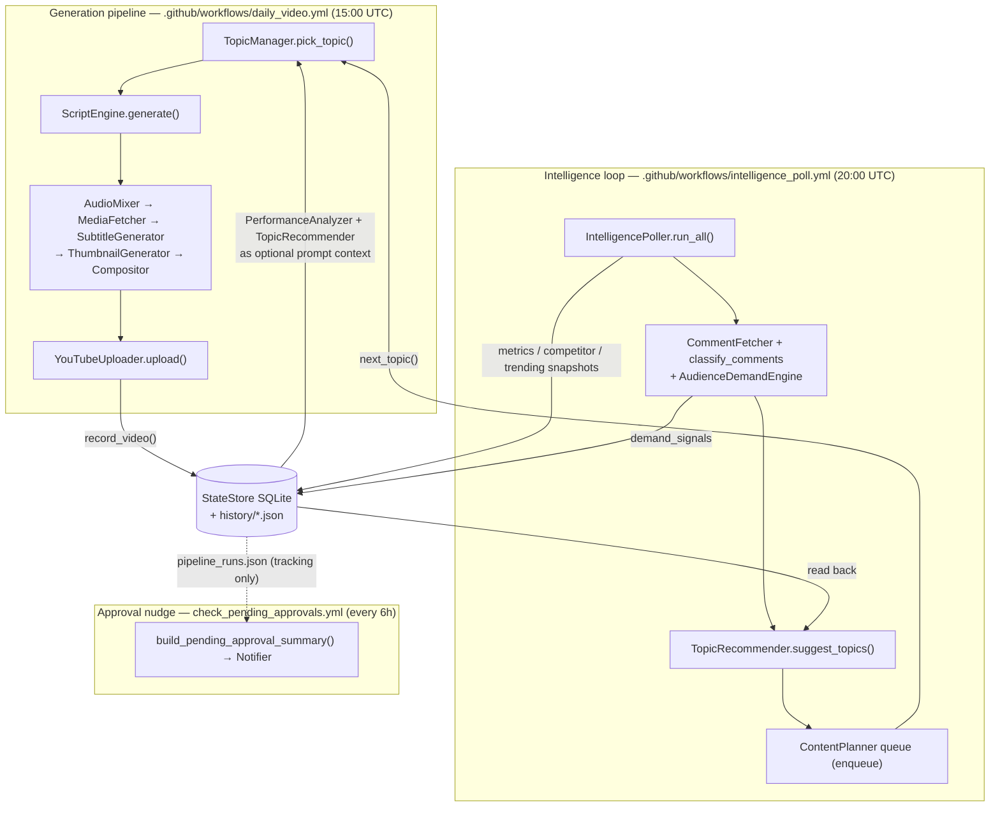

# Chronos History Lab — Architecture

Chronos History Lab is an autonomous YouTube-automation bot for a
"history mysteries" channel. It has two distinct halves:

1. **A per-video generation pipeline** — picks a topic, researches it, writes a
   retention-optimized script with Gemini, synthesizes audio, fetches stock
   media, generates word-by-word subtitles and A/B thumbnails, composites a
   final MP4, and uploads it to YouTube.
2. **A continuous-intelligence feedback loop** — on a separate schedule, polls
   the channel's own analytics, competitor channels, YouTube trending, and
   audience comments; persists what it finds; and turns that persisted data
   into ranked topic suggestions that feed back into the next video's topic
   selection and script prompt.

The two halves run as independent scheduled jobs and communicate only through
shared persistence (a SQLite database and a handful of JSON flat-files under
`history/`). Nothing in the intelligence loop calls the generation pipeline
directly, and vice versa.

> **Status note.** As of this writing, zero GitHub Actions workflow runs have
> occurred. The persistence tables and the feedback wiring described below
> exist in code and are unit-testable in isolation, but they have not yet been
> exercised end-to-end against live credentials. Where a capability is a
> deliberate placeholder or is intentionally not-yet-wired, this document says
> so explicitly.

---

## 1. Overview

The dashed line from the database to the approval nudge is deliberate: the
`PipelineStateMachine` records what happened at each stage but does **not** gate
the upload (see §2).

---

## 2. The generation pipeline

Entry point: **`main.py`** → `run()`. The module docstring numbers eight
headline stages; the code additionally interleaves a research pass and an
advisory fact-check pass. Flags: `--niche`, `--topic`, `--privacy`
(`private`/`unlisted`/`public`), `--no-upload`, `--list-channels`,
`--script-file` (reuse a saved script JSON and skip both Gemini calls).

### Stage 0 — Asset synthesis
`tools/generate_assets.ensure_assets()` synthesizes any missing SFX/music WAVs
so they need not be committed. Existing files are never overwritten, so real
recordings dropped into `assets/` take precedence.

### Stage 1 — Topic selection
`modules/topic_manager.py` → `TopicManager.pick_topic(niche)`. This is the
consumer side of the feedback loop:
- First checks `ContentPlanner`'s queue (`_try_queued_topic()`); a queued
  suggestion that clears the originality check is used directly, spending **no**
  Gemini call.
- Otherwise `_generate_topic()` asks Gemini for a fresh topic, appending — as
  *optional inspiration, never a directive* — `TopicRecommender`'s trend/demand
  suggestions and `PerformanceAnalyzer`'s past-performance context (see §7).
- `OriginalityEngine` (`modules/originality_engine.py`) catches paraphrased
  repeats via model2vec embeddings + rapidfuzz, beyond the exact-string
  exclusion list of the last 80 used topics.

Key dependency: **Gemini** (`GEMINI_MODEL`, via `modules/gemini_client.py`).
Persists: nothing yet at pick time; the chosen topic is registered to
`history/topics.json` and the originality vector store only after the run, via
`register_topic()`.

### Research pass (interleaved, advisory)
`modules/research_engine.py` → `research_topic()` asks Gemini to recall what it
knows and return a structured `ResearchBrief` (`key_facts` with self-rated
confidence + caveats, `open_questions`, `suggested_angle`). This is **unverified
LLM recall** — the module has no web-search/retrieval tool and deliberately
exposes no `sources` field. A parse failure returns an empty brief rather than
raising. Dependency: **Gemini**.

### Stage 2 — Script generation
`modules/script_engine.py` → `ScriptEngine.generate(topic, research_brief)`.
Produces a `Script` dataclass from a strict JSON schema (`SCRIPT_SYSTEM_PROMPT`)
encoding retention psychology: a climax-first hook, 2-3 open loops, inline
`[PAUSE:n]`, `[SFX:name]`, `[MUSIC:cue]`, and `[VOICE:main|secondary]` cues, and
per-section Pexels `keywords`. Research notes are appended by
`_format_research_notes()` framed as "unverified, use as inspiration."
Dependency: **Gemini**. Persists: `output/<slug>/script.json` (reusable via
`--script-file`).

### Fact-check pass (interleaved, advisory only)
`modules/claim_extractor.extract_claims()` (heuristic sentence-splitting, not an
LLM call) feeds `modules/fact_checker.fact_check_claims()`. Flags claims for
human review but **never blocks** generation or upload. Persists:
`output/<slug>/fact_check.json`.

### Pipeline-stage tracking (capture/tracking only — does NOT gate publishing)
`main.py` constructs a `PipelineStateMachine`
(`modules/pipeline_stages.py`) and advances a `PipelineRun` through
`TOPIC → RESEARCH → SCRIPT → FACT_CHECK → HUMAN_APPROVAL`. This produces an
honest audit record of what happened at each stage, written to
`history/pipeline_runs.json`.

**Crucially, `approve()` is never called in `main.py`, and the upload below does
not consult this state at all.** The state machine *can* structurally forbid
reaching `PUBLISH` without `human_approved` (its `advance()` refuses the
`PUBLISH` transition without a prior `approve()`), but the real upload path is
independent of it. Wiring an actual approval requirement into publishing is a
deliberate, not-yet-taken follow-up. As written, the run stops tracking at
`HUMAN_APPROVAL` and the video uploads regardless.

### Stage 3 — Audio mixing
`modules/audio_mixer.py` → `AudioMixer.build(script)`. Multi-voice TTS
(Edge-TTS by default via `EDGE_TTS_VOICE`/`EDGE_TTS_SECONDARY_VOICE`, or
ElevenLabs when `TTS_PROVIDER=elevenlabs`), layered with SFX and cue-driven
dynamic music (`MUSIC_VOLUME_MAP`), honoring in-place `[PAUSE]` timing via
`ScriptSection.tts_timeline()`. Dependencies: **Edge-TTS** (or ElevenLabs),
**pydub**. Persists a mixed audio file and a section timeline under
`output/<slug>/`.

### Stage 4 — Media fetching
`modules/media_fetcher.py` → `MediaFetcher.fetch_videos()/fetch_images()`.
Downloads HD stock footage and images from **Pexels** (Pixabay endpoint
constants are also present) using the per-section keywords Gemini already
emitted (so no extra API round-trip), falling back to topic words. Dependency:
**Pexels API** (`PEXELS_API_KEY`).

### Stage 5 — Subtitles
`modules/subtitle_generator.py` → `SubtitleGenerator`. Transcribes the mixed
audio with **OpenAI Whisper** (`base` model) to word-level timestamps, writes an
SRT, and builds word-by-word animated caption specs. Dependency: **Whisper**.

### Stage 6 — Thumbnails
`modules/thumbnail_generator.py` → `ThumbnailGenerator.generate()`. Two A/B
thumbnails via **Pillow** with a shock-text overlay (`thumbnail_overlay_text`),
using fetched images as backgrounds. Dependency: **Pillow**.

### Stage 7 — Compositor
`modules/compositor.py` → `Compositor.render()`. Assembles clips, Ken-Burns
image pans, the audio track, and the animated subtitles into the final MP4 with
**MoviePy** (pinned `moviepy==1.0.3`, with a Pillow-10 `ANTIALIAS` shim).
Dependency: **MoviePy / FFmpeg / ImageMagick**.

### Stage 8 — Upload (unconditional; publish gate NOT enabled)
`modules/youtube_uploader.py` → `YouTubeUploader.upload()`. Uploads via the
**YouTube Data API v3** with OAuth2, optionally targeting a specific channel
(`YOUTUBE_CHANNEL_ID`) and setting the A thumbnail. In `main.py` this runs
**unconditionally, gated only by `--no-upload`** — not by the fact-check
results and not by the `PipelineStateMachine`'s approval state. On success it
records the video via `StateStore.record_video()`; on failure it logs and keeps
the local file. The topic is registered as used **regardless** of upload success
(so a bad token doesn't cause the same topic to be re-picked next run).

---

## 3. The intelligence / feedback loop

Entry point: **`tools/run_intelligence_poll.py`**, invoked on a cron schedule.
It runs three independent passes, each defensive on its own.

**Pass 1 — analytics / competitor / trend polling.**
`modules/intelligence_poller.py` → `IntelligencePoller.run_all()`:
- `poll_own_channel_metrics()` — for each recently-published video in
  `StateStore.list_videos()`, pulls a short analytics window via
  `modules/analytics_client.py` (`AnalyticsClient.video_performance`, YouTube
  Analytics API v2, OAuth) and writes a `metrics_snapshots` row.
- `poll_competitors()` — `modules/competitor_monitor.py` (`CompetitorMonitor.poll`)
  reads each channel's recent uploads via a quota-efficient
  `channels.list → playlistItems.list → videos.list` chain (never the
  100-unit `search.list`), and persists `competitor_snapshots` rows with a
  computed `view_velocity`.
- `poll_trends()` — `modules/trend_detector.py` (`TrendDetector.trending`) reads
  `videos.list(chart="mostPopular")` and persists `trending_snapshots` rows.

Every per-sub-call is wrapped in its own try/except: one bad video, one quota
error, or one whole subsystem being down degrades to an empty/zero result for
just that piece.

**Pass 2 — comments → audience demand.**
`poll_comments_for_recent_videos()` fetches top-level comments with
`modules/comment_fetcher.py` (`CommentFetcher`, YouTube Data API v3), classifies
them in batches with `modules/comment_intelligence.py` (`classify_comments`,
Gemini — sentiment/category/**prompt-injection flag**, with comments JSON-encoded
into a fenced data block so untrusted comment text can never become
instructions), then `modules/audience_demand.py` (`AudienceDemandEngine.analyze`)
clusters `topic_request` comments into ranked `DemandSignal`s persisted as
`demand_signals` rows.

**Pass 3 — turn persisted data into queued topics.**
`enqueue_topic_suggestions()` calls `modules/topic_recommender.py`
(`TopicRecommender.suggest_topics()`), which reads the three persisted tables
(`trending_snapshots` + `competitor_snapshots` concatenated as one trend signal,
plus `demand_signals`) back out and ranks them via
`modules/content_opportunity.py` (`ContentOpportunityEngine.rank()` — blends
view-velocity/percentile trend scores with mention-count demand scores, merging
matching trend+demand items into `source="both"` with an explainable
`rationale`). Each suggestion is enqueued into `modules/content_planner.py`
(`ContentPlanner`), whose exact-string dedup means re-running the poll against an
unchanged database reuses existing queued entries rather than growing the queue.

**Closing the loop.** On the next generation run, `TopicManager.pick_topic()`
consumes the `ContentPlanner` queue first (`_try_queued_topic()`), and its Gemini
topic prompt additionally receives `TopicRecommender.suggest_topics_as_prompt_text()`
and `PerformanceAnalyzer.analyze_videos_as_prompt_text()` as optional context.
That is the full feedback cycle: **published video → metrics/competitor/trend/
comment data → ranked opportunities → queued/prompted topic → next video.**

> `modules/performance_analyzer.py` (`PerformanceAnalyzer`, computes
> `views_per_day` from persisted metrics) is wired into `topic_manager.py`.
> `TopicRecommender` is consumed both by the poller (producer) and the topic
> prompt (consumer). Both modules' own docstrings note they degrade to empty
> output when their tables are empty — the common case until the poller has a
> confirmed successful run.

---

## 4. Persistence

### SQLite — `history/chronos.db` (`modules/state_store.py`)
Path overridable via `CHRONOS_STATE_DB`. Schema (`_SCHEMA`):

| Table | Key columns | Written by | Read by |
|---|---|---|---|
| `videos` | `video_id` (PK), `topic`, `title`, `slug`, `published_at`, `privacy`, `category_id`, `local_path` | `main.py` (`record_video`) | poller, `PerformanceAnalyzer` |
| `metrics_snapshots` | `video_id`, `snapshot_date` (unique together), `views`, `likes`, `comment_count`, `watch_time_minutes`, `average_view_duration_seconds` | `poll_own_channel_metrics` | `PerformanceAnalyzer` |
| `competitor_snapshots` | `video_id`, `polled_date` (unique together), `channel_id`, `title`, `view_count`, `like_count`, `comment_count`, `published_at`, `view_velocity` | `poll_competitors` | `TopicRecommender` |
| `trending_snapshots` | `video_id`, `polled_date`, `region_code` (unique together), `title`, `view_count`, `like_count`, `comment_count`, `published_at`, `category_id` | `poll_trends` | `TopicRecommender` |
| `demand_signals` | `id` (PK), `topic_phrase`, `mention_count`, `example_comment_ids`, `polled_date` | comment pass | `TopicRecommender` |

The three snapshot tables upsert on their unique keys (a re-poll for the same
date overwrites); `demand_signals` is an append-only log (clustering can produce
different representative phrasings per run).

### JSON flat-files (under `history/`)
- **`topics.json`** — `TopicManager` history: `used_topics` exclusion list and a
  `sessions` log (topic, date, video path, video id/url).
- **`content_calendar.json`** — `ContentPlanner`'s FIFO topic queue of
  `CalendarEntry` records (`queued`/`published`/`skipped`). A write-through JSON
  store, explicitly a placeholder rather than a `state_store` table.
- **`pipeline_runs.json`** — `PipelineStateMachine`'s per-run stage history and
  `human_approved` flag (tracking only; see §2). Also a placeholder store.
- **`topic_vectors.npz`** — `OriginalityEngine`'s flat numpy vector store of
  topic embeddings (path overridable via `CHRONOS_TOPIC_VECTORS`).

Per-video artifacts (script JSON, fact-check JSON, media, subtitles, thumbnails,
final MP4) live under `output/<slug>/`.

---

## 5. Scheduling — GitHub Actions (`.github/workflows/`)

All three restore/save the `history/` directory via `actions/cache` so state
persists between runs, and all support `workflow_dispatch` for manual runs.

| Workflow | Cron (UTC) | Runs | Purpose |
|---|---|---|---|
| `daily_video.yml` | `0 15 * * *` (daily 15:00) | `python main.py` | The full generation pipeline. Installs ffmpeg/imagemagick/fonts, generates assets, restores YouTube token + client secret from secrets, uploads the video as an artifact. |
| `intelligence_poll.yml` | `0 20 * * *` (daily 20:00) | `python tools/run_intelligence_poll.py` | The intelligence loop — 5h after the video job so a fresh upload has some time to accrue views/comments. Supports a `skip_comments` input. |
| `check_pending_approvals.yml` | `0 */6 * * *` (every 6h) | `python tools/check_pending_approvals.py` | A human nudge (not a pipeline step, always exits 0): reads `pipeline_runs.json` and, if any run sits at `HUMAN_APPROVAL`, prints a summary and posts to Slack if configured. |

---

## 6. Configuration & secrets

Loaded in `config.py` (via `python-dotenv`) and the workflows. Missing values
degrade gracefully rather than crashing (see §7).

| Variable | Enables | Missing → |
|---|---|---|
| `GEMINI_API_KEY` | All Gemini calls (topic, research, script, comment classification) | Generation cannot produce a script. |
| `PEXELS_API_KEY` | Stock video/image fetch (Stage 4) | No stock media fetched. |
| `YOUTUBE_CLIENT_SECRET_FILE` + OAuth token | Upload + own-channel analytics + comment fetch | Upload/analytics/comment passes skipped or fail-soft. |
| `YOUTUBE_CHANNEL_ID` | Targets a specific (brand) channel; verified at startup | Uploads to the default channel of the account. |
| `YOUTUBE_PRIVACY` | Default upload privacy (`private`/`unlisted`/`public`) | Defaults to `private`. |
| `YOUTUBE_DATA_API_KEY` | API-key (non-OAuth) reads for competitor + trend polling | Those polls fail-soft to empty. |
| `COMPETITOR_CHANNEL_IDS` | Comma-separated channels to monitor | Empty → no competitor polling. |
| `SLACK_WEBHOOK_URL` | Slack delivery of pending-approval summaries | `log` channel only (always on). |
| `TTS_PROVIDER` / `EDGE_TTS_VOICE` / `ELEVENLABS_*` | TTS backend and voices | Defaults to free Edge-TTS. |
| `SCRIPT_LANGUAGE`, `VIDEO_DURATION_TARGET`, `MUSIC_VOLUME`, `SFX_VOLUME`, `BLAS_THREADS`, `GEMINI_MAX_RETRIES`, `SUBTITLE_HIGHLIGHT_COLOR`, `CHRONOS_STATE_DB`, `CHRONOS_TOPIC_VECTORS` | Tuning knobs | Sensible defaults in `config.py`. |

Secrets in CI arrive via `secrets.*` (`GEMINI_API_KEY`, `PEXELS_API_KEY`,
`YOUTUBE_TOKEN_JSON`, `YOUTUBE_CLIENT_SECRET_JSON`, `YOUTUBE_DATA_API_KEY`,
`SLACK_WEBHOOK_URL`, `YOUTUBE_CHANNEL_ID`) and `vars.COMPETITOR_CHANNEL_IDS`.

---

## 7. Design principles

### Graceful degradation
Every intelligence module wraps its dependencies in try/except and returns an
empty/None result rather than raising, so no single failure aborts a run:
- `TopicManager._safe_make_recommender()`, `_safe_make_content_planner()`,
  `_safe_make_performance_analyzer()`, `_safe_originality_check()`,
  `_safe_originality_register()` — construction/call failures leave topic
  selection working with less context.
- `IntelligencePoller`'s per-sub-call try/except in `poll_own_channel_metrics`,
  `poll_competitors`, `poll_trends`, and the `_persist_*` helpers.
- `TopicRecommender.suggest_topics()` and `PerformanceAnalyzer.analyze_videos()`
  degrade to `[]`/`0.0`/`""` on any store or ranking failure.
- `gemini_client.generate_with_retry()` retries transient 429/5xx but gives up
  immediately on a per-day quota (no point waiting).
- `Notifier`'s always-on `log` channel plus fail-soft Slack.

### Honesty-preserving framing
Real persisted data fed into prompts is always framed as optional
context/inspiration, never as a directive or as verified fact:
- `script_engine._format_research_notes()` — labels research as "unverified,
  use as inspiration — verify anything presented as fact."
- `topic_recommender.suggest_topics_as_prompt_text()` — "not mandatory — use
  your judgment."
- `performance_analyzer.analyze_videos_as_prompt_text()` — "for context only —
  not a formula to copy," and returns `""` below two videos of data (one point
  is not a pattern).
- `research_engine` refuses to emit a `sources`/`citations` field it cannot
  honestly populate, and self-rates every claim's confidence.
- `comment_intelligence` treats all comment text as untrusted data, not
  instructions, and flags suspected prompt-injection for human review.

### Not-yet-wired, honestly labeled
The `PipelineStateMachine` approval chain is implemented and can structurally
forbid `PUBLISH` without approval, but is intentionally **not** wired to gate the
real upload (§2). `ContentPlanner` and `PipelineStateMachine` use placeholder
JSON stores pending a possible move into `state_store`. These are documented
follow-ups, not hidden gaps.
